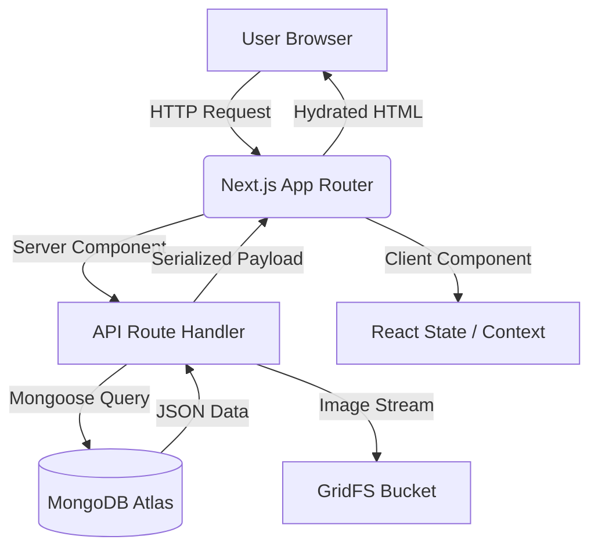

# 👗 Fashion Mart — High-Fidelity E-Commerce Clone


> A premium, production-ready shopping experience clone featuring seamless data synchronization, robust authentication, and a high-performance media delivery system.

---

## 🌟 Project Overview

**Fashion Mart** is a sophisticated full-stack web application built to replicate a modern fashion storefront. It balances aesthetic precision with engineering rigor, utilizing **Next.js 15** for optimized rendering and **MongoDB** for flexible data management.

### Key Highlights
- **🎨 High-Fidelity UI**: ~90% visual accuracy to design references with a custom motion system.
- **🔄 Dynamic Sync**: Automated pipeline to ingest and normalize data from external APIs (DummyJSON).
- **🛡️ Secure Auth**: Dual-layered identity system: standard database users for clients and environment-locked master credentials for staff.
- **🛠️ Specialized Portals**: Fully isolated Client Storefront and Admin Inventory Manager with distinct navigation and layouts.
- **📦 Smart Persistence**: Unified wishlist and shopping cart logic that merges guest sessions into user accounts.
- **🛒 Checkout & Orders**: Authenticated users can complete simulated purchases, receive branded HTML confirmation emails, and review their full order history on the My Orders page.
- **🖼️ GridFS Integration**: Internal high-performance image streaming with aggressive caching.

---

## 🏗️ Architecture & Tech Stack

### Frontend
- **React 19 / Next.js 15**: Leveraging Server Components for SEO and Client Components for interactivity.
- **Tailwind CSS 4**: A utility-first styling approach with custom design tokens for brand consistency.
- **Shared Layouts**: Persistent navigation and footer logic managed via the App Router.

### Backend (Serverless)
- **Route Handlers**: Standardized RESTful API endpoints with unified error/success shaping.
- **Mongoose**: Schematized object modeling for MongoDB.
- **GridFS**: Distributed storage for product media, bypassing standard database document limits.

### Code Flow Diagram



---

## 📂 Folder Structure

```text
nickelfox-website-clone/
├── 📁 public/              # Static assets (brand logos, icons)
├── 📁 src/
│   ├── 📁 app/             # App Router pages & API handlers
│   │   ├── 📁 api/         # REST Endpoints (Auth, Products, Sync)
│   │   └── 📁 (routes)     # Fashion, Lifestyle, Admin, Wishlist
│   ├── 📁 components/      # Atomic UI components
│   │   ├── 📁 home/        # Section-specific marketing blocks
│   │   ├── 📁 shared/      # Reusable cards, intros, buttons
│   │   └── 📁 providers/   # Global Auth & Toast contexts
│   ├── 📁 lib/             # Core business logic & utilities
│   │   ├── 📁 api/         # Client-side fetch wrappers
│   │   └── 📁 config/      # Route & Endpoint constants
│   └── 📁 models/          # Mongoose Schemas (User, Product, etc.)
├── 📄 jsconfig.json        # Path aliasing (@/*)
└── 📄 package.json         # Dependency manifest
```

---

## 🚀 Execution & Code Flow

### 1. The Sync Pipeline
When an admin triggers a sync, the system:
1. Fetches raw data from `dummyjson.com`.
2. **Normalizes** categories and generates marketing taglines.
3. Downloads remote images and uploads them to **GridFS**.
4. Performs an **Upsert** in MongoDB to ensure data freshness without duplicates.

### 2. Checkout & Order Flow
When an authenticated user checks out:
1. Cart items and total are `POST`ed to `/api/checkout`.
2. A unique `transactionId` is generated and the order is persisted to MongoDB.
3. A branded HTML confirmation email is dispatched via Nodemailer (non-blocking).
4. The client is redirected to `/orders` where the new order appears at the top.

### 3. Authentication Lifecycle
- **Clients**: Standard signup/login flow using database-backed users and email verification.
- **Staff**: Specialized login portal (`/admin-login`) verifying against `ADMIN_EMAILS` and `ADMIN_PASSWORD` env variables.
- **Authorization**: Role-based guards prevent client users from accessing the `/admin` workspace.

### 4. Unified Wishlist
- **Guests**: Items are stored against a `sessionId` (UUID) stored in a long-lived cookie.
- **Users**: Upon login, the system automatically migrates all `sessionId` entries to the user's `userId` and deletes the guest reference.

---

## 🛠️ Installation & Setup

1. **Clone the repository**
   ```bash
   git clone https://github.com/your-username/fashion-mart.git
   ```

2. **Install dependencies**
   ```bash
   npm install
   ```

3. **Environment Configuration**
   Create a `.env.local` file in the root:
   ```env
   MONGODB_URI=your_mongodb_connection_string
   AUTH_JWT_SECRET=your_secure_random_string
   SMTP_HOST=smtp.gmail.com
   SMTP_USER=your_email
   SMTP_PASS=your_app_password
   ```

4. **Run Development Server**
   ```bash
   npm run dev
   ```

---

## 🔮 Future Upgrades

- [ ] **Stripe Integration**: Replace the current simulated checkout with real payment processing via Stripe or PayPal.
- [ ] **Advanced Filtering**: Add price-range sliders and color-swatch filtering.
- [ ] **Product Reviews**: Interactive user feedback system with verified purchase badges.
- [ ] **PWA Support**: Offline browsing and native-like installation for mobile users.
- [ ] **AI Recommendations**: Personalized "Complete the Look" suggestions based on browsing history.

---

## 📝 License

Distributed under the MIT License. See `LICENSE` for more information.

**Developed with ❤️ by the Fashion Mart Engineering Team.**
